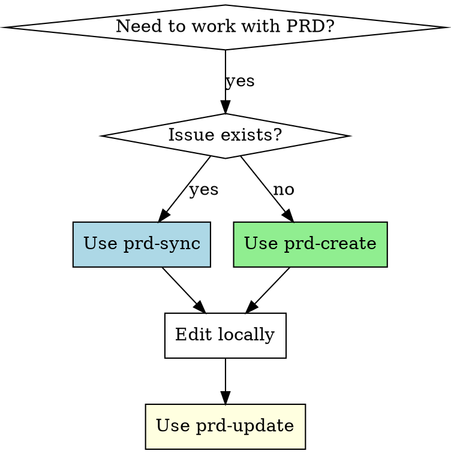

# PRD Versioning in GitHub/GitLab Issues

## Overview

Manage versioned Product Requirements Documents (PRDs) in GitHub or GitLab issues using metatags for identification and tracking. Each PRD has a unique ID, version number, and timestamp to enable proper change tracking.

**Storage model (the core idea):**

- The issue **description** always holds the **latest full PRD** — it is the single source of truth for the current state.
- Each **comment** holds **only the diff** of one version transition (a machine-applicable patch), never the full document.
- Versions are recoverable by walking the comment chain backwards from the description (`prd-restore`), reverse-applying patches.

To keep that chain robust, **volatile lines** (`PRD-VERSION`, `PRD-UPDATED`, `**Versão**`, `**Atualizado**`, `**Status**`) are normalized out before diffing — they never appear in a patch, so editing the status (e.g. via `prd-approve`) never breaks recovery.

The skill automatically detects whether you're working in a GitHub or GitLab repository and uses the appropriate CLI (`gh` or `glab`).

## When to Use



**Use when:**
- Creating a new PRD issue from scratch
- Updating an existing PRD in a GitHub issue
- Synchronizing a PRD from an existing issue to local editing
- Need to track PRD versions and changes

**NOT for:**
- Simple issue descriptions without PRD structure
- Documents that don't require version tracking

## Core Pattern

### Before (Without Versioning)
```markdown
# PRD for Feature X

Basic requirements...
[Edited directly in GitHub, no history]
```

### After (With Versioning)
```markdown
<!--
PRD-ID: feature-x
PRD-VERSION: 1.2
PRD-UPDATED: 2026-04-15 14:30:00
-->

# PRD: Feature X

**Version**: 1.2
**Updated**: 15/04/2026 14:30
...
```

## Quick Reference

| Task | Script | Usage |
|------|--------|-------|
| Create new PRD + issue | `prd-create` | `./bin/prd-create <prd-id> "<title>" [labels]` |
| Sync latest PRD from issue description | `prd-sync` | `./bin/prd-sync <issue-number>` |
| Publish update (overwrites description, comments the diff) | `prd-update` | `./bin/prd-update <prd-file>` |
| Preview diff vs live description | `prd-diff` | `./bin/prd-diff <prd-file>` |
| Recover an old version from the diff chain | `prd-restore` | `./bin/prd-restore <issue-number> <version>` |
| Approve PRD version | `prd-approve` | `./bin/prd-approve <prd-file>` |

## Platform Detection

The skill automatically detects whether you're working in a GitHub or GitLab repository:

1. **Environment Variable**: Set `PRD_PLATFORM=github` or `PRD_PLATFORM=gitlab` to force a specific platform
2. **Git Remote**: If not set, checks `git remote -v` for `gitlab` or `github` in the URL
3. **Fallback**: Defaults to GitHub if detection fails

**Requirements**:
- GitHub: `gh` CLI installed and authenticated
- GitLab: `glab` CLI installed and authenticated

Both platforms use the same workflow and commands - the skill handles the differences internally.

**Note for self-hosted GitLab instances**: If your GitLab instance uses a custom domain (not containing "gitlab" in the URL), set the `PRD_PLATFORM=gitlab` environment variable to force GitLab mode.

## Implementation

### Metatag Format

Every PRD (description + local file) must include at the top:

```markdown
<!--
PRD-ID: {unique-identifier}
PRD-VERSION: {major.minor}
PRD-UPDATED: {YYYY-MM-DD HH:MM:SS}
ISSUE-NUMBER: {issue_number}
-->
```

Every diff **comment** carries hidden chain metatags so `prd-restore` can order and walk the chain:

```markdown
<!--
PRD-ID: {unique-identifier}
ISSUE-NUMBER: {issue_number}
PRD-DIFF-FROM: {previous version}
PRD-DIFF-TO: {new version}
-->

## 📋 PRD v{new} — Mudanças desde v{previous}
...
```diff
{unified diff with ---/+++ headers}
```
```

### Scenario 1: New Issue (No PRD exists)

```bash
# Step 1: Use /prd skill to generate PRD content
/prd

# The skill will interview you about:
# - The core problem you're solving
# - Success metrics
# - Constraints (budget, tech stack, deadlines)
# - User personas and stories
# - Technical specifications

# Step 2: Create PRD and issue together (auto-detects GitHub or GitLab)
./bin/prd-create "hpos-compat" "Compatibilidade HPOS" "feature"

# Step 3: Replace generated template with /prd output
# Edit prd/hpos-compat.md and paste the /prd content

# Output: Creates prd/hpos-compat.md and issue
```

### Scenario 2: Existing Issue (PRD already exists)

```bash
# Sync PRD from issue to local file (auto-detects GitHub or GitLab)
./bin/prd-sync 390

# Output: Creates prd/hpos-README-prd-390.md

# Edit locally
vim prd/hpos-README-prd-390.md

# Update issue with new version
./bin/prd-update prd/hpos-README-prd-390.md
```

### Script Behavior

**prd-sync** reads the issue **description** (the latest full PRD) into a local file. It never reads comments — they only hold diffs.

**prd-update** publishes a new version:
1. Fetches the **live issue description** as the diff baseline (`PRD-DIFF-FROM`).
2. Auto-increments `PRD-VERSION` (or uses the version you pass) → `PRD-DIFF-TO`.
3. Normalizes volatile lines on both sides, generates a machine-applicable unified diff.
4. Posts a **comment containing only that diff** (plus hidden chain metatags).
5. **Overwrites the issue description** with the full latest document.
6. Aborts without posting if there is no substantive content change.

**prd-restore** recovers an old version:
- Walks the comment chain backwards from the description, reverse-applying patches (`patch -R`) until it reaches the target version.
- **Strict validation**: aborts and names the broken link if a patch is missing or fails to apply. Never produces a silently-corrupt document.
- Writes a local file for review (`prd/<id>-issue-<n>-v<version>.md`); does **not** touch the issue. Re-publish with `prd-update` if desired.

**prd-approve** edits the `**Status**` line on the live description (🟢 Aprovado) and posts an approval comment. Status is volatile (normalized out of the chain), so this never breaks `prd-restore`.

**Legacy issues** (old model, with full PRDs in comments): clean break. The new model applies from the next `prd-update` onward; `prd-restore` only reaches versions created by the new flow.

## Common Mistakes

| Mistake | Problem | Fix |
|---------|---------|-----|
| Editing the description by hand | No diff recorded; breaks the restore chain baseline silently | Always `prd-sync` → edit locally → `prd-update` |
| Putting full document in a comment | Defeats the model; comments are diffs only | Let `prd-update` post the diff; full doc lives in the description |
| Editing/deleting old diff comments | Breaks the chain; `prd-restore` will abort at that link | Treat diff comments as immutable history |
| Missing metatags | Cannot identify PRD or walk the chain | Keep PRD-ID, PRD-VERSION, ISSUE-NUMBER intact |
| Not incrementing version | Cannot track evolution | Use `prd-update` which auto-increments |

## Rationalization Trap

| Rationalization | Reality |
|-----------------|---------|
| "Just editing the issue is faster" | Loses all history and makes tracking impossible |
| "The content speaks for itself" | Without PRD-ID, cannot identify which PRD this is |
| "Version numbers are overkill" | No way to know if looking at current or old PRD |
| "I'll remember to track changes" | Memory fails; metatags provide definitive record |

**Violating the letter of these rules is violating the spirit of PRD versioning.**

## File Structure

```
prd/
├── {prd-id}.md                       # Custom ID PRDs (Scenario 1)
├── {prd-id}-issue-{n}.md             # Synced PRDs (Scenario 2)
└── {prd-id}-issue-{n}-v{version}.md  # Recovered versions (prd-restore)
```

## Workflow Summary

```bash
# New PRD
/prd                                    # Generate PRD content with discovery
./bin/prd-create <id> "<title>"        # Create PRD file + issue (full PRD in description)
vim prd/<id>.md                         # Replace with /prd output
./bin/prd-update prd/<id>.md           # Overwrite description, comment the diff

# Existing PRD
./bin/prd-sync <issue>                  # Pull latest full PRD from description
vim prd/<file>.md
./bin/prd-diff prd/<file>.md            # Preview diff vs live description
./bin/prd-update prd/<file>.md          # Publish

# Recover an old version
./bin/prd-restore <issue> v1.2          # Reverse-applies the diff chain → local file
```
