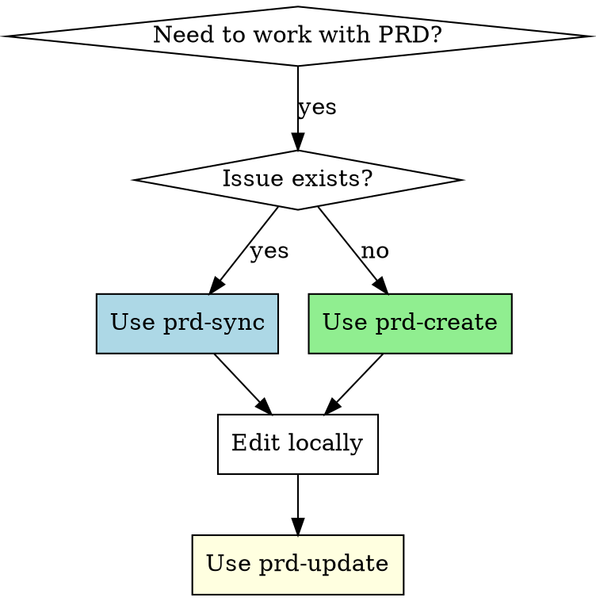

# PRD Versioning in GitHub/GitLab Issues

## Overview

Manage versioned Product Requirements Documents (PRDs) in GitHub or GitLab issues using metatags for identification and tracking. Each PRD has a unique ID, version number, and timestamp to enable proper change tracking.

The skill automatically detects whether you're working in a GitHub or GitLab repository and uses the appropriate CLI (`gh` or `glab`).

## When to Use



**Use when:**
- Creating a new PRD issue from scratch
- Updating an existing PRD in a GitHub issue
- Synchronizing a PRD from an existing issue to local editing
- Need to track PRD versions and changes

**NOT for:**
- Simple issue descriptions without PRD structure
- Documents that don't require version tracking

## Core Pattern

### Before (Without Versioning)
```markdown
# PRD for Feature X

Basic requirements...
[Edited directly in GitHub, no history]
```

### After (With Versioning)
```markdown
<!--
PRD-ID: feature-x
PRD-VERSION: 1.2
PRD-UPDATED: 2026-04-15 14:30:00
-->

# PRD: Feature X

**Version**: 1.2
**Updated**: 15/04/2026 14:30
...
```

## Quick Reference

| Task | Script | Usage |
|------|--------|-------|
| Create new PRD + issue | `prd-create` | `./bin/prd-create <prd-id> "<title>" [labels]` |
| Sync PRD from issue | `prd-sync` | `./bin/prd-sync <issue-number>` |
| Update PRD in issue | `prd-update` | `./bin/prd-update <prd-file>` |
| View local changes | `prd-diff` | `./bin/prd-diff <prd-file>` |
| Approve PRD version | `prd-approve` | `./bin/prd-approve <prd-file>` |

## Platform Detection

The skill automatically detects whether you're working in a GitHub or GitLab repository:

1. **Environment Variable**: Set `PRD_PLATFORM=github` or `PRD_PLATFORM=gitlab` to force a specific platform
2. **Git Remote**: If not set, checks `git remote -v` for `gitlab` or `github` in the URL
3. **Fallback**: Defaults to GitHub if detection fails

**Requirements**:
- GitHub: `gh` CLI installed and authenticated
- GitLab: `glab` CLI installed and authenticated

Both platforms use the same workflow and commands - the skill handles the differences internally.

**Note for self-hosted GitLab instances**: If your GitLab instance uses a custom domain (not containing "gitlab" in the URL), set the `PRD_PLATFORM=gitlab` environment variable to force GitLab mode.

## Implementation

### Metatag Format

Every PRD must include at the top:

```markdown
<!--
PRD-ID: {unique-identifier}
PRD-VERSION: {major.minor}
PRD-UPDATED: {YYYY-MM-DD HH:MM:SS}
ISSUE-NUMBER: {issue_number}
-->
```

### Scenario 1: New Issue (No PRD exists)

```bash
# Step 1: Use /prd skill to generate PRD content
/prd

# The skill will interview you about:
# - The core problem you're solving
# - Success metrics
# - Constraints (budget, tech stack, deadlines)
# - User personas and stories
# - Technical specifications

# Step 2: Create PRD and issue together (auto-detects GitHub or GitLab)
./bin/prd-create "hpos-compat" "Compatibilidade HPOS" "feature"

# Step 3: Replace generated template with /prd output
# Edit prd/hpos-compat.md and paste the /prd content

# Output: Creates prd/hpos-compat.md and issue
```

### Scenario 2: Existing Issue (PRD already exists)

```bash
# Sync PRD from issue to local file (auto-detects GitHub or GitLab)
./bin/prd-sync 390

# Output: Creates prd/hpos-README-prd-390.md

# Edit locally
vim prd/hpos-README-prd-390.md

# Update issue with new version
./bin/prd-update prd/hpos-README-prd-390.md
```

### Script Behavior

**prd-sync** searches for latest PRD:
1. Checks issue comments for `PRD-ID` metatag
2. If found, uses most recent comment (by `PRD-UPDATED`)
3. If not found, uses issue description

**prd-update** increments version:
- Increments `PRD-VERSION` automatically
- Updates `PRD-UPDATED` timestamp
- Posts comment with diff and full PRD content
- **Does NOT include "action required" text** (only in initial issue description)

## Common Mistakes

| Mistake | Problem | Fix |
|---------|---------|-----|
| Editing issue directly | No version tracking | Always use `prd-sync` → edit → `prd-update` |
| Missing metatags | Cannot identify PRD | Include PRD-ID, PRD-VERSION, PRD-UPDATED |
| Not incrementing version | Cannot track evolution | Use `prd-update` which auto-increments |
| Skipping local edit | No git history | Edit `prd/*.md` files locally |

## Rationalization Trap

| Rationalization | Reality |
|-----------------|---------|
| "Just editing the issue is faster" | Loses all history and makes tracking impossible |
| "The content speaks for itself" | Without PRD-ID, cannot identify which PRD this is |
| "Version numbers are overkill" | No way to know if looking at current or old PRD |
| "I'll remember to track changes" | Memory fails; metatags provide definitive record |

**Violating the letter of these rules is violating the spirit of PRD versioning.**

## File Structure

```
prd/
├── {prd-id}.md              # Custom ID PRDs (Scenario 1)
└── hpos-README-prd-{n}.md   # Synced PRDs (Scenario 2)
```

## Workflow Summary

```bash
# New PRD
/prd                                    # Generate PRD content with discovery
./bin/prd-create <id> "<title>"        # Create PRD file and issue
vim prd/<id>.md                         # Replace with /prd output
./bin/prd-update prd/<id>.md           # Update issue

# Existing PRD
./bin/prd-sync <issue>
vim prd/<file>.md
./bin/prd-update prd/<file>.md
```
