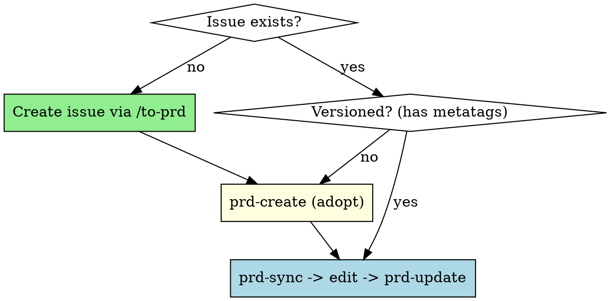

# PRD Versioning in GitHub/GitLab Issues

## Overview

Manage versioned Product Requirements Documents (PRDs) in GitHub or GitLab issues using metatags for identification and tracking. Each PRD has a unique ID, version number, and timestamp to enable proper change tracking.

**Storage model (the core idea):**

- The issue **description** always holds the **latest full PRD** — it is the single source of truth for the current state.
- Each **comment** holds **only the diff** of one version transition (a machine-applicable patch), never the full document.
- Versions are recoverable by walking the comment chain backwards from the description (`prd-restore`), reverse-applying patches.

**No local files persist.** The issue and its comments are the only source of truth. Commands never leave a file behind: `prd-sync`/`prd-restore` print to **stdout**, and `prd-create`/`prd-update` act on the live issue. When you edit a PRD, the working copy lives in **your context** — you write it to a throwaway file under `${TMPDIR:-/tmp}/prd-versioning/<repo>/` only to hand it to `prd-update`, which deletes it on success.

To keep the diff chain robust, **volatile lines** (`PRD-VERSION`, `PRD-UPDATED`, `**Versão**`, `**Atualizado**`, `**Status**`) are normalized out before diffing — they never appear in a patch, so editing the status (e.g. via `prd-approve`) never breaks recovery.

The skill automatically detects whether you're working in a GitHub or GitLab repository and uses the appropriate CLI (`gh` or `glab`).

## When to Use



**Use when:**
- Adopting a `/to-prd`-created issue into version tracking
- Updating an existing PRD in a GitHub/GitLab issue
- Reading the latest PRD from an issue to edit it
- Recovering an old PRD version from the diff chain

**NOT for:**
- Creating the issue itself — use `/to-prd` (it writes the PRD with the correct structure and publishes the issue)
- Simple issue descriptions without PRD structure
- Documents that don't require version tracking

## Relationship with /to-prd

`/to-prd` is what **creates the issue**: it synthesizes the PRD (Problem Statement, Solution, User Stories, Implementation Decisions, Testing Decisions, Out of Scope, Further Notes) and publishes it with the `ready-for-agent` label. It does **not** add versioning metatags.

`prd-versioning` takes over from there: `prd-create <issue>` adopts that issue by stamping the versioning metatags (baseline v1.0) onto its description. From then on every change is tracked.

## Quick Reference

| Task | Script | Usage |
|------|--------|-------|
| Adopt an existing issue (stamp metatags v1.0) | `prd-create` | `./bin/prd-create <issue-number> [prd-id]` |
| Print the latest PRD from the description | `prd-sync` | `./bin/prd-sync <issue-number>` |
| Preview diff of a candidate vs live description | `prd-diff` | `./bin/prd-diff <issue-number> <prd-file>` |
| Publish update (comment diff, overwrite description, delete file) | `prd-update` | `./bin/prd-update <issue-number> <prd-file> [version]` |
| Recover an old version (printed to stdout) | `prd-restore` | `./bin/prd-restore <issue-number> <version>` |
| Approve PRD version | `prd-approve` | `./bin/prd-approve <issue-number> [version]` |

Every command takes the **issue number**. Editable content flows through stdout (read) and a throwaway file (write); nothing is kept on disk.

## Platform Detection

The skill automatically detects whether you're working in a GitHub or GitLab repository, in this order:

1. **Environment Variable**: Set `PRD_PLATFORM=github` or `PRD_PLATFORM=gitlab` to force a specific platform
2. **Obvious host name**: checks `git remote -v` for `gitlab` or `github` in the URL
3. **CLI host config**: matches the remote's host against the hosts `glab`/`gh` have authenticated to (reads `~/.config/glab-cli/config.yml` and `~/.config/gh/hosts.yml`). This covers **self-hosted instances on custom domains** (e.g. `greatcode.aztecweb.net`) with no extra configuration — just authenticate the CLI first.
4. **Fallback**: whichever CLI is installed; `unknown` if it can't tell (then set `PRD_PLATFORM`).

**Requirements**:
- GitHub: `gh` CLI installed and authenticated
- GitLab: `glab` CLI installed and authenticated, plus `jq` (used to parse the GitLab API responses)

GitLab data is read through `glab api` (JSON), so descriptions are handled robustly even when the PRD body itself contains `---` separators or other markup. Both platforms use the same workflow and commands — the skill handles the differences internally.

**Self-hosted GitLab**: authenticate once with `glab auth login --hostname <your-host>`. Detection then works automatically. If you skip auth or detection still fails, force it with `PRD_PLATFORM=gitlab`.

The skill derives the GitLab **host and project path directly from the `origin` remote** and passes them explicitly to `glab` (`--hostname` for `glab api`, `--repo https://host/group/repo` for `glab issue`). This means it works even when the remote host doesn't match `glab`'s default configured host or `GITLAB_HOST` — no need to set `GITLAB_HOST`. If your remote layout can't be parsed automatically, override the project path with `PRD_GITLAB_PROJECT=group/repo` (or `group/subgroup/repo`).

**Which repository the skill targets**: the remote is read from the **target project's git repo**, resolved (in order) from `PRD_REPO_DIR`, then the git toplevel of the current directory. Run the commands from the project root, or set `PRD_REPO_DIR=/path/to/project` if you invoke them from elsewhere (e.g. while `cd`'d into the skill's own checkout). If the resolved remote contradicts the target platform (e.g. platform is `gitlab` but the remote is `github.com`), the skill aborts with an actionable message instead of querying the wrong host — set `PRD_REPO_DIR`/`PRD_PLATFORM` to correct it.

**Self-hosted example** (host `git.animaeducacao.com.br`): from the project root, `PRD_PLATFORM=gitlab ./bin/prd-sync <issue>`; or from anywhere, `PRD_REPO_DIR=/path/to/project PRD_PLATFORM=gitlab /abs/path/bin/prd-sync <issue>`.

## Implementation

### Metatag Format

Every PRD description carries at the top (added by `prd-create`):

```markdown
<!--
PRD-ID: {unique-identifier}
PRD-VERSION: {major.minor}
ISSUE-NUMBER: {issue_number}
PRD-UPDATED: {YYYY-MM-DD HH:MM:SS}
-->
```

Every diff **comment** carries hidden chain metatags so `prd-restore` can order and walk the chain:

```markdown
<!--
PRD-ID: {unique-identifier}
ISSUE-NUMBER: {issue_number}
PRD-DIFF-FROM: {previous version}
PRD-DIFF-TO: {new version}
-->

## 📋 PRD v{new} — Mudanças desde v{previous}
...
```diff
{unified diff with ---/+++ headers}
```
```

### Scenario 1: New PRD

```bash
# Step 1: Create the issue with /to-prd (writes the PRD + publishes it)
/to-prd

# Step 2: Adopt the issue into version tracking (stamps metatags v1.0)
./bin/prd-create 390
# Optional explicit PRD-ID: ./bin/prd-create 390 hpos-compatibilidade
```

### Scenario 2: Editing an existing versioned PRD

```bash
# Read the latest PRD (printed to stdout — capture it into your context)
./bin/prd-sync 390

# Edit the content in context, then write it to a throwaway file
#   (anywhere under ${TMPDIR:-/tmp}/prd-versioning/<repo>/ so it gets cleaned)

# Preview what would be published
./bin/prd-diff 390 /tmp/prd-versioning/<repo>/hpos.md

# Publish: comments the diff, overwrites the description, deletes the file
./bin/prd-update 390 /tmp/prd-versioning/<repo>/hpos.md
```

### Script Behavior

**prd-create** adopts an existing issue: it fetches the live description, prepends the metatag block plus the `**Versão**/**Atualizado**/**Status**` header (baseline v1.0), and writes it back to the description. Idempotent — if the description already has `PRD-ID`, it does nothing. Leaves no local file.

**prd-sync** prints the issue **description** (the latest full PRD) to **stdout**. It never reads comments — they only hold diffs. Diagnostics go to stderr so stdout carries only the PRD.

**prd-update** publishes a new version:
1. Fetches the **live issue description** as the diff baseline (`PRD-DIFF-FROM`).
2. Auto-increments `PRD-VERSION` (or uses the version you pass) → `PRD-DIFF-TO`.
3. Normalizes volatile lines on both sides, generates a machine-applicable unified diff.
4. Posts a **comment containing only that diff** (plus hidden chain metatags).
5. **Overwrites the issue description** with the full latest document.
6. Aborts without posting (and keeps the file) if there is no substantive content change.
7. On success, **deletes the input file** — but only if it lives under `${TMPDIR:-/tmp}/prd-versioning/`; a path outside that base is left untouched.

**prd-diff** previews the exact diff `prd-update` would publish (candidate file vs live description, volatile lines normalized). Read-only: never publishes, never deletes the file.

**prd-restore** recovers an old version:
- Walks the comment chain backwards from the description, reverse-applying patches (`patch -R`) until it reaches the target version.
- **Strict validation**: aborts and names the broken link if a patch is missing or fails to apply. Never produces a silently-corrupt document.
- Prints the recovered version to **stdout** for review; does **not** touch the issue or write a file. To re-publish, save the output to a file and run `prd-update`.

**prd-approve** reads the **live description** (version, PRD-ID, status), edits the `**Status**` line (🟢 Aprovado) and posts an approval comment. No local file. Status is volatile (normalized out of the chain), so this never breaks `prd-restore`.

## Common Mistakes

| Mistake | Problem | Fix |
|---------|---------|-----|
| Editing the description by hand | No diff recorded; breaks the restore chain baseline silently | Always `prd-sync` → edit → `prd-update` |
| Putting full document in a comment | Defeats the model; comments are diffs only | Let `prd-update` post the diff; full doc lives in the description |
| Editing/deleting old diff comments | Breaks the chain; `prd-restore` will abort at that link | Treat diff comments as immutable history |
| Running `prd-update` before adopting | Description has no metatags; update refuses | Adopt first with `prd-create <issue>` |
| Keeping PRD copies on disk | They go stale vs the issue (the source of truth) | Re-read with `prd-sync` whenever you need the current state |

## Rationalization Trap

| Rationalization | Reality |
|-----------------|---------|
| "Just editing the issue is faster" | Loses all history and makes tracking impossible |
| "The content speaks for itself" | Without PRD-ID, cannot identify which PRD this is |
| "Version numbers are overkill" | No way to know if looking at current or old PRD |
| "I'll keep a local copy to be safe" | The issue is the source of truth; a local copy only drifts |

**Violating the letter of these rules is violating the spirit of PRD versioning.**

## Workflow Summary

```bash
# New PRD
/to-prd                                 # Create the issue (PRD + publish)
./bin/prd-create <issue>                # Adopt: stamp versioning metatags (v1.0)

# Edit an existing PRD
./bin/prd-sync <issue>                  # Print latest full PRD (capture into context)
#   edit in context -> write to a temp file under /tmp/prd-versioning/<repo>/
./bin/prd-diff <issue> <prd-file>       # Preview diff vs live description
./bin/prd-update <issue> <prd-file>     # Publish; deletes the temp file

# Approve
./bin/prd-approve <issue>               # Flip status, post approval (reads live)

# Recover an old version
./bin/prd-restore <issue> v1.2          # Reverse-applies the diff chain -> stdout
```
